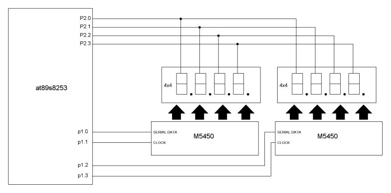
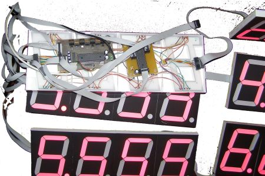
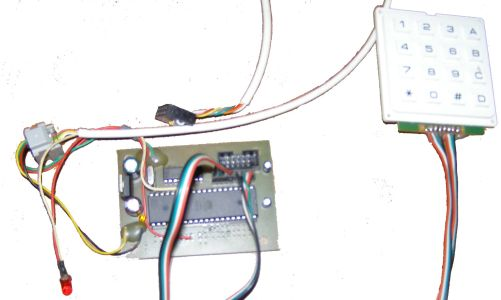

# 7 Segment Anzeige mit M5450
## Haupteigenschaften
- MCU Kern AT89S8253
- Displaytreiber M5450
- 32 Anzeigestellen
- Steuerbar über PC oder 4x4 Matriztastatur(in einem separaten Bedienteil via Serial Port)
- Die letzten Werte werden intern in EEPROM gespeichert

## Ansteuerung von STMicroelectronics M5450
Das Display wird im Multiplexverfahren betrieben. Anbindung an PC erfolgt über die RS232 Schnittstelle. Wenn kein PC zur Verfügung steht, kann das Display mit dem Bedienteil, ebenfalls über RS232, angesteuert werden. Alles wichtiges ist im Quellcode kommentiert. Fals Fragen, antworte gerne auf eMails.

## Bilder von Testmodulen

